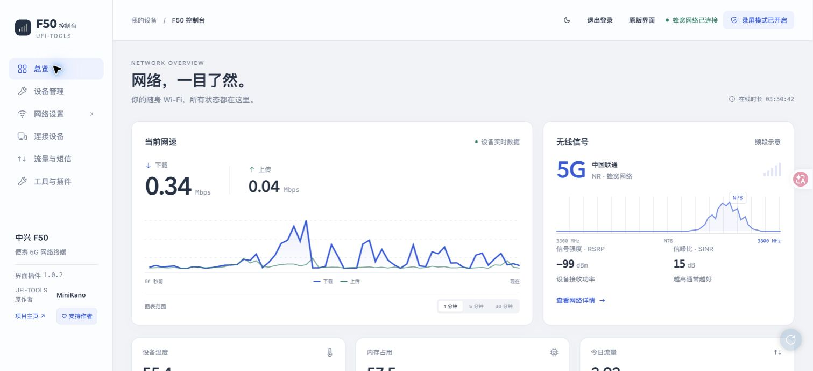
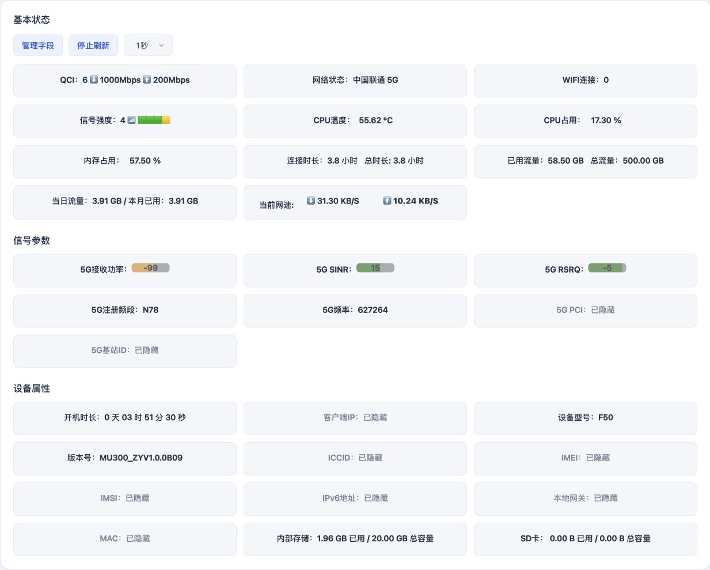

# F50 UFI 控制台界面插件

给普通中兴 F50 的 UFI-TOOLS 高级后台提供新的控制台界面。保留原有设置与插件交互，重新整理导航、配色和布局。

[下载 v1.0.2 安装包](https://github.com/weixunkkkkk/f50-ufi-console-ui/releases/tag/v1.0.2) · [更新记录](CHANGELOG.md)

下载 Release 里的 ZIP 压缩包后先解压，再导入中文文件名的 HTML。若直接从仓库下载 HTML，请保留 `F50控制台界面_1.0.2.html` 文件名，不要改名后重复添加。

适用于普通中兴 F50 的 UFI-TOOLS 高级后台，已在 UFI-TOOLS 4.1.5 上验证。导入并提交后，重新打开后台会自动加载；浅色、深色与录屏模式偏好由各浏览器分别保存。

## 使用与安装

连接 F50 所在网络后，打开设备的 UFI-TOOLS 后台。默认地址是 http://192.168.0.1:2333/ ，地址或端口已修改时使用自己的地址。

安装步骤：

1. **先解压 ZIP，再导入里面的 `F50控制台界面_1.0.2.html`，不要把 ZIP 压缩包直接添加到插件列表。**
2. 登录 UFI-TOOLS，进入「插件功能」，点击「添加插件」，选择这个 HTML 文件。界面虽然可能写着“.txt 文件”，实际导入控件没有限制扩展名。
3. 点击「提交」保存，再刷新后台。保持原有插件，不需要清空列表。
4. 若同名界面插件已存在，导入会替换同名插件。不要改名后重复添加。

从 1.0.0 或 1.0.1 升级时，在插件列表中删除旧的界面 HTML，再添加 `F50控制台界面_1.0.2.html` 并提交。只移除旧界面插件，保留信号、温度、核心等其他插件。

这是 UFI-TOOLS 后台插件，不是 Chrome 扩展。文件包含 HTML、CSS 和 JavaScript，直接在后台导入；不用双击打开 HTML 文件安装。

## 导航与布局

| 分类 | 入口 |
| --- | --- |
| 总览 | 设备数据、吞吐量曲线、基本状态、信号参数、设备属性；下方为原有信号和温度监控 |
| 设备管理 | 账户、刷新、口令/密码、重启、指示灯、更新、语言、核心开关 |
| 网络设置 | Wi-Fi、内网、APN、数据、漫游、USB 与连接方式 |
| 网络子菜单 | 默认收起；点击网络设置后展开锁定频段与锁定基站，再点击可收起 |
| 连接设备 | 在主页面查看原有 Wi-Fi、有线设备列表与操作 |
| 流量与短信 | 流量管理、历史、测速、短信与转发 |
| 工具与插件 | 插件管理、AT、高级功能、定时任务、其他独立插件面板 |

普通按钮和选择框统一使用主题色，开启状态使用绿色。桌面操作区三列，手机两列；下拉箭头位于框内右侧 18 像素。文字放大并适度加粗。工具与设备列表直接显示在主页面；原版设置弹窗使用实色背景。

两款监控仍由各自原插件提供，本插件只移动其面板并调整样式。如果未安装原监控插件，对应卡片不会显示；核心开关同样依赖原核心插件。

## 基本状态与设备属性

总览向下滚动，在两款监控插件上方显示原版状态区：基本状态、信号参数和设备属性。它仍由 UFI-TOOLS 原有刷新程序更新，保留「管理字段」、停止/继续刷新、刷新频率和字段的原版点击复制事件。桌面三列、手机两列，并与浅色/深色主题统一。显示的字段遵循原版「管理字段」选择；未勾选的字段不会强制显示。

## 后来安装的插件

新插件仍通过原「插件功能」安装和保存。常规独立面板会归入「工具与插件 → 其他插件面板」；新增功能按钮归入工具区。两款指定监控继续放在总览。

自动归类支持添加在原主容器、功能列表、功能容器或页面主体下的独立面板：面板使用 `.kano_function_main`，或直接带 `.title` / 标题元素。仅提供脚本、悬浮球、特殊嵌套页面的插件保留原有结构；无法识别的布局可通过原版界面查看。不会重新执行第三方脚本，也不会复制插件节点或点击事件。动态加入面板并保留原点击事件已用本地兼容性页面验证；没有逐一验证插件商店全部插件。

## 原版与录屏

点击右上角「原版界面」或按 Shift+Escape 可以切回原版。原版顶部固定显示「返回新版界面」，点击后重新启用新版；刷新后保持选择。

- 直接恢复新版：http://192.168.0.1:2333/?f50_ui=on
- 直接进入原版：http://192.168.0.1:2333/?f50_ui=off

如果后台地址或端口不同，在自己的后台地址后加 `?f50_ui=on` 或 `?f50_ui=off`。直达链接会更新当前浏览器的偏好，完成切换后自动清除这个参数。以上切换只影响当前浏览器；必须已安装本插件，链接才会生效。

录屏模式隐藏总览网关、状态区的 IMEI/ICCID/IMSI、MAC、地址、手机号、基站 ID/PCI，以及连接设备列表中的名称、地址等详情。原版设置弹窗中的内容仍需自行检查。

总览读取 UFI-TOOLS 已有设备状态；当前网速是吞吐量，不是峰值测速。频段曲线是示意图。原信号插件保留自身的解析、模拟与数据源标注，拍摄时应检查其数据源；不要把模拟值当实测。

## 作者与验证

UFI-TOOLS 原作者：MiniKano，项目 https://github.com/kanoqwq/UFI-TOOLS 。左侧「支持作者」沿用原后台打赏窗口，原赞赏码链接为 https://api.kanokano.cn/pay/zsm.png 。信号监控：@卡夫卡；温度内存监管：欢喜猴。

已检查真实后台浅色/深色色块、功能分类、接入列表、监控面板、网络菜单展开收起、手机布局与新标签页加载。锁定、重启、密码更改、核心切换、拉黑等设备操作未作为界面验收触发。其他后台版本尚未验证。

安装包仅含界面插件和说明、校验记录，不含账号口令、SIM 标识、设备固件或原插件备份。此界面插件自身不写入设备网络、串码或固件设置。

## 许可

本仓库新增的界面代码采用 MIT 许可。UFI-TOOLS 与第三方插件由各自作者维护，按各自项目的许可使用；本仓库不包含它们的代码或安装包。
